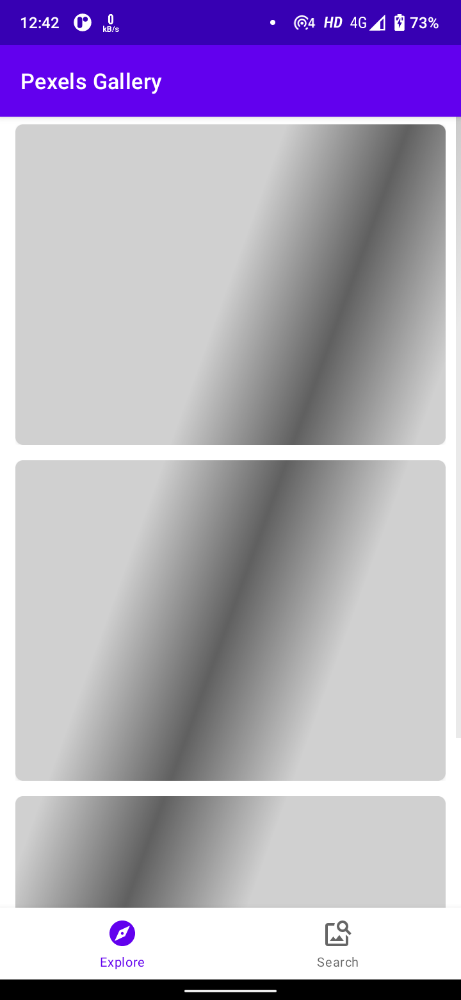
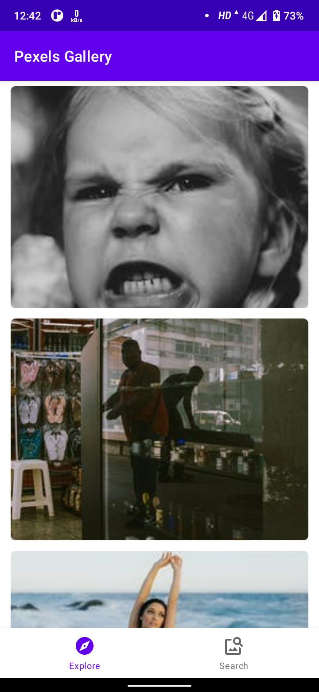
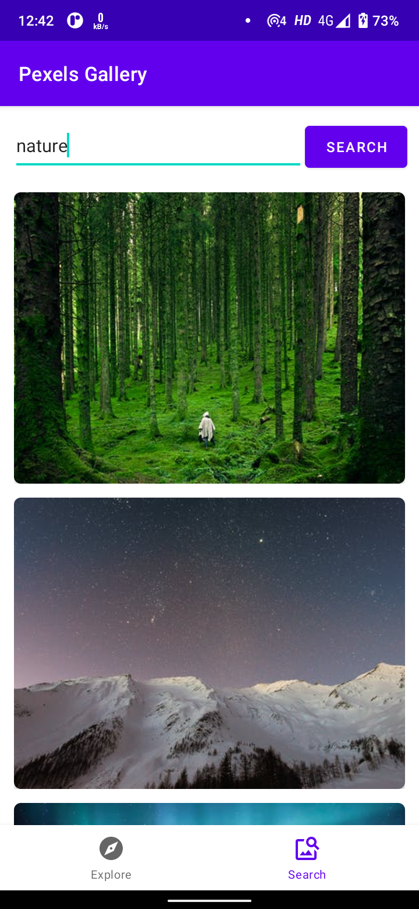
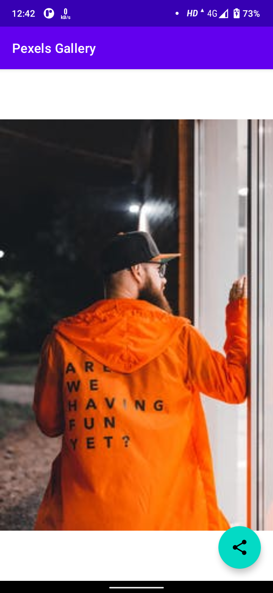

# Pexels Gallery App
### Developer Days Week 2 Challenge

MVVM architecture

Network calling

## Tech Stack:
-   Android
-   Paging 3
-   Retrofit
-   Coil
-   Kotlin

## Setup API key
-   Get api key from Pexels
-   Create a `secrets.properties` file in root project directory
-   Add this line `PEXELS_API_KEY=<api-key>` with the api key
-   Build once and the api key is available throughout the project using `BuildConfig.API_KEY`

## Screenshots

